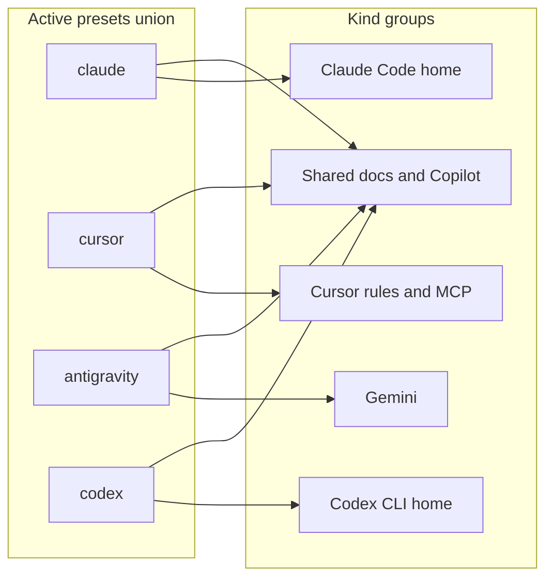

# Sources presets and indexing

Onboarding notes for how **tool presets** (`akashi.sources.presets`), **discovery**, and the **sidebar Source Index** fit together.

## Presets vs kinds (conceptual)

Active presets are combined: a source **kind** is indexed if it belongs to **any** enabled preset. Cross-tool docs (for example `AGENTS.md`, Copilot instructions) are included on every preset; tool-specific kinds apply only when that preset is on.

## Preset matrix

Each cell is **included** when that preset is enabled in settings. Settings key: `akashi.sources.presets` (array of `claude`, `cursor`, `antigravity`, `codex`). The table matches [`SOURCE_KINDS_BY_PRESET`](../src/domains/sources/domain/sourcePresets.ts); if code and this doc diverge, **trust the code**.

| `SourceKind` | Typical role | claude | cursor | antigravity | codex |
|--------------|--------------|:------:|:------:|:-----------:|:-----:|
| `agents_md` | `AGENTS.md` / `agents.md` | yes | yes | yes | yes |
| `dot_agents_md` | `.agents.md` | yes | yes | yes | yes |
| `team_guide_md` | `TEAM_GUIDE.md` / `team_guide.md` | yes | yes | yes | yes |
| `github_copilot_instructions_md` | `.github/copilot-instructions.md` | yes | yes | yes | yes |
| `claude_md` | `CLAUDE.md`, `~/.claude/CLAUDE.md` | yes | — | — | — |
| `claude_settings_json` | `.claude/settings.json`, `settings.local.json`, home | yes | — | — | — |
| `claude_rules_md` | `.claude/rules/*.md`, home rules | yes | — | — | — |
| `claude_hook_file` | `.claude/hooks/**`, home hooks | yes | — | — | — |
| `codex_config_toml` | `.codex/config.toml` (project or home) | — | — | — | yes |
| `codex_agents_override_md` | `AGENTS.override.md` (any directory) | — | — | — | yes |
| `codex_rules_file` | `.codex/rules/*.rules` (e.g. `default.rules`) | — | — | — | yes |
| `cursor_legacy_rules` | `.cursorrules`, home | — | yes | — | — |
| `cursor_rules_mdc` | `.cursor/rules/*.mdc`, home | — | yes | — | — |
| `cursor_mcp_json` | `.cursor/mcp.json`, `~/.cursor/mcp.json` | — | yes | — | — |
| `gemini_md` | `GEMINI.md`, `~/.gemini/GEMINI.md` | — | — | yes | — |
| `agents_skill_md` | `.agents/skills/**/SKILL.md` | yes | yes | yes | — |
| `cursor_skill_md` | `.cursor/skills/**/SKILL.md`, `~/.cursor/skills/**/SKILL.md` | — | yes | — | — |
| `claude_skill_md` | `.claude/skills/**/SKILL.md`, `~/.claude/skills/**/SKILL.md` | yes | yes | — | — |
| `codex_skill_md` | `.codex/skills/**/SKILL.md`, `<Codex home>/skills/**/SKILL.md` | — | yes | — | yes |
| `gemini_antigravity_skill_md` | `.agent/skills/**/SKILL.md`, `~/.gemini/antigravity/skills/**/SKILL.md` | — | — | yes | — |

## Design notes

### Two related filters

- **Indexing** uses `getAllowedSourceKinds()` (from active presets) so the workspace scanner and optional home scan only touch paths that can yield allowed [`SourceKind`](../src/domains/sources/domain/model.ts) values.
- **Payload building** in the sidebar host still runs [`filterRecordsByPresets`](../src/sidebar/host/sourcesPresetFilter.ts) when assembling the snapshot sent to the webview. That way the sidebar matches the **current** preset selection even if a **persisted** snapshot on disk was produced under different settings, until the user runs a full index again (changing presets also triggers re-index in [`SidebarViewProvider`](../src/sidebar/host/SidebarViewProvider.ts)).

### Single source of truth for preset membership

[`sourcePresets.ts`](../src/domains/sources/domain/sourcePresets.ts) owns **which kinds belong to which preset** (`SOURCE_KINDS_BY_PRESET`). The bridge adds **per-file `presets`** on each [`SourceDescriptor`](../src/sidebar/bridge/sourceDescriptor.ts) via [`presetsContainingKind`](../src/domains/sources/domain/sourcePresets.ts) for **labels and tooltips** in the tree, not as a second definition of membership.

### Catalog index (no file body in the snapshot)

The index stores **[`IndexedSourceEntry`](../src/domains/sources/domain/model.ts)** rows: path, kind, scope, origin, and **metadata from `stat` only** (size and mtime via [`NodeSourceFileStats`](../src/domains/sources/infrastructure/NodeSourceFileStats.ts)). **File contents are not read** into the index or persisted. The sidebar opens files by path in the editor; the webview never receives raw text.

Snapshots are persisted under `sources.lastSnapshot.v2` in extension global state (key bumped when the shape dropped bodies/blocks).

## User config directory overrides

When **Sources: Include Home Config** is on, the scanner resolves **user-scope** tool directories as follows (VS Code settings win over environment variables when set; the extension host only sees env vars that were present when VS Code launched—often not the same as an interactive shell).

| Setting (`akashi.sources.*`) | Role | Env fallback (if setting empty) | Default directory |
|-------------------------------|------|-----------------------------------|-------------------|
| `claudeConfigDir` | Single Claude Code user root (settings, rules, hooks, skills, `CLAUDE.md`) | `CLAUDE_CONFIG_DIR` (absolute) | `~/.claude` |
| `geminiConfigDir` | Single Gemini user root (`GEMINI.md`, `antigravity/skills`, etc.) | `GEMINI_CONFIG_DIR` (absolute) | `~/.gemini` |
| `cursorConfigDir` | Single Cursor user root (`mcp.json`, `rules`, `skills`) | *(none)* | `~/.cursor` |
| `codexHome` | Single Codex CLI user root (`config.toml`, `rules`, home `skills`, etc.) | `CODEX_HOME` (absolute) | `~/.codex` |

**Claude**, **Gemini**, **Cursor**, and **Codex** each use **one effective root** (setting → env where applicable → default under OS user home).

Implementation: [`providerUserRoots.ts`](../src/domains/sources/infrastructure/providerUserRoots.ts), [`collectHomeSourcePaths`](../src/domains/sources/infrastructure/sourceDiscoveryPlan.ts), and user-scope kind detection in [`VscodeWorkspaceSourceScanner.ts`](../src/domains/sources/infrastructure/VscodeWorkspaceSourceScanner.ts).

## Related code paths

- Presets from VS Code: [`vscodeSourcePresetConfig.ts`](../src/domains/sources/infrastructure/vscodeSourcePresetConfig.ts)
- Globs and home paths: [`sourceDiscoveryPlan.ts`](../src/domains/sources/infrastructure/sourceDiscoveryPlan.ts); optional `akashi.sources.*` directory strings: [`vscodeSourcesDirSettings.ts`](../src/domains/sources/infrastructure/vscodeSourcesDirSettings.ts) + [`userConfigDirPath.ts`](../src/domains/sources/infrastructure/userConfigDirPath.ts).
- Service wiring: [`createSourcesService.ts`](../src/domains/sources/infrastructure/createSourcesService.ts)
